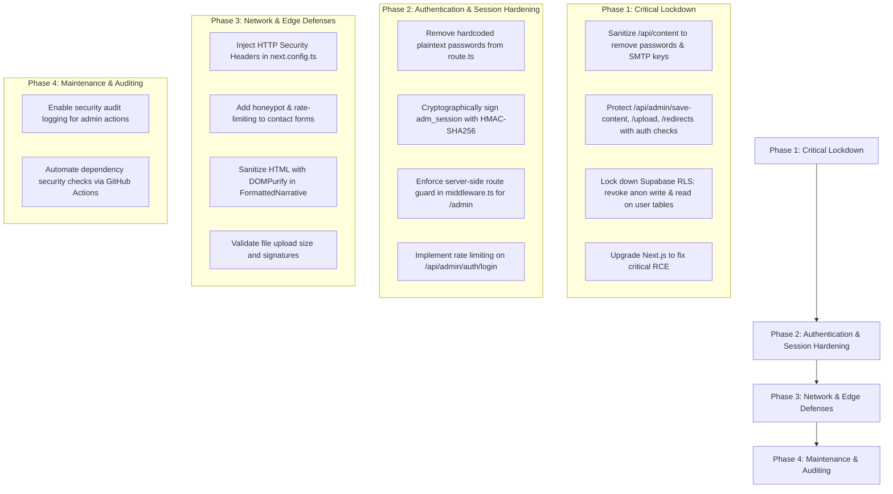

# 🛡️ Nose Creek Physiotherapy - Comprehensive Cybersecurity Audit & Security Hardening Plan

**Date:** September 23, 2026  
**Auditor:** Senior Cyber Security Specialist & Full-Stack Security Architect  
**Scope:** Full-stack source code, API routes, authentication/authorization model, Supabase database RLS, dependencies, and hosting configuration.  
**Severity Scale:** Critical | High | Medium | Low  

---

## Executive Summary

A comprehensive source-code and architectural security analysis was conducted on the entire Nose Creek codebase. While the public-facing pages are fast and well-structured, the backend and database layers currently contain **several critical vulnerabilities** that must be addressed to prevent unauthorized access, data theft, and defacement.

The most urgent risks include **unprotected admin API endpoints**, **public disclosure of database password hashes and SMTP email credentials**, and **overly permissive Supabase Row Level Security (RLS) policies** that allow any anonymous web browser to read all patient inquiries and overwrite database tables.

---

## 🚨 Critical Severity Vulnerabilities (Immediate Action Required)

### 1. Unauthenticated Admin API Endpoints (Broken Access Control - OWASP A01)
* **Affected Files:**
  - `src/app/api/admin/save-content/route.ts`
  - `src/app/api/admin/upload/route.ts`
  - `src/app/api/admin/redirects/route.ts`
* **Vulnerability Description:**
  These API endpoints process administrative mutations (updating services, conditions, settings, uploading files to Supabase Storage, and configuring 301/302 redirects). **None of these routes verify session cookies or authentication headers.**
* **Impact:**
  Any attacker or automated script on the internet can send a `POST` request to `/api/admin/save-content` or `/api/admin/redirects` without logging in, and modify all site content, wipe databases, or redirect all clinic visitors to a malicious phishing site.
* **Remediation:**
  Implement a central server-side authentication guard (`verifyAdminSession(req)`) that verifies the cryptographic session token/cookie on every admin API route before executing any database or filesystem operation.

---

### 2. Public Data Leakage of Passwords and SMTP Credentials (Sensitive Data Exposure - OWASP A02)
* **Affected File:**
  - `src/app/api/content/route.ts` (Lines 49 & 51)
* **Vulnerability Description:**
  The public endpoint `/api/content?type=settings` is fetched by standard site components (Header, Footer, ConditionTiles) for every website visitor. The code currently serializes:
  ```ts
  marketing: supaSettings.marketing || {},
  notifications: supaSettings.marketing?.notifications || supaSettings.notifications || {},
  ```
  `site_settings.marketing` contains `auth_credentials` (the bcrypt password hashes and usernames for Master Admin and Client) and `notifications` (which holds SMTP server credentials: `smtpHost`, `smtpUser`, `smtpPass`, or `resendApiKey`).
* **Impact:**
  Any visitor inspecting network traffic in DevTools can view the administrator's password hashes and the clinic's private email/SMTP passwords or API keys.
* **Remediation:**
  Sanitize public API responses by explicitly stripping `auth_credentials`, `smtpPass`, `resendApiKey`, and any sensitive tokens before returning data to the client.

---

### 3. Insecure Supabase Row Level Security (RLS) Permitting Anonymous DB Hijacking
* **Affected File:**
  - `src/lib/supabase/schema.sql` (Lines 308-330 & 406-416)
* **Vulnerability Description:**
  The database schema defines policies with `FOR ALL USING (true) WITH CHECK (true)` on:
  - `form_submissions` (Patient leads, names, emails, phone numbers, health inquiries)
  - `site_settings`, `services`, `conditions`, `team_members`, `locations`, `blog_posts`, `testimonials`
  - `admin_users` (`FOR SELECT USING (true)` and `FOR UPDATE USING (true)`)
  - `client_users` (`FOR SELECT USING (true)` and `FOR UPDATE USING (true)`)
  - `storage.objects` (`FOR INSERT/UPDATE/DELETE USING (bucket_id = 'media')`)
* **Impact:**
  Because `NEXT_PUBLIC_SUPABASE_ANON_KEY` is embedded in the public JavaScript bundle, anyone with browser DevTools can connect directly to PostgREST and:
  1. Export all confidential patient leads and consultation requests (HIPAA & PIPEDA privacy violation).
  2. Overwrite user password hashes in `admin_users` to take over the admin portal.
  3. Delete or deface all images in the `media` storage bucket.
* **Remediation:**
  1. Revoke public `INSERT`, `UPDATE`, and `DELETE` on all content and user tables for the `anon` role.
  2. Make `admin_users` and `client_users` completely private (accessible only via Supabase `service_role` on the secure backend).
  3. Allow only public `SELECT` on published content and public `INSERT` on `form_submissions` (with rate limiting / bot protection).

---

### 4. Critical Next.js Remote Code Execution (RCE) Vulnerability (GHSA-p293-qw3h-jr36)
* **Affected Package:** `next@16.3.2`
* **Vulnerability Description:**
  `npm audit` detected a Critical RCE vulnerability affecting Next.js versions `< 16.3.3` on Windows servers and image optimization with AVIF/libheif.
* **Remediation:**
  Update `next` to `^16.3.6` or the latest stable patch release.

---

## ⚠️ High Severity Vulnerabilities

### 5. Hardcoded Passwords in Source Code
* **Affected File:** `src/app/api/admin/auth/login/route.ts`
* **Description:**
  `AUTHORITATIVE_CREDENTIALS` previously contained plaintext `raw_password` strings directly in the source file.
* **Remediation:**
  Remove all plaintext passwords from source code. Passwords are now verified exclusively against secure bcrypt hashes.

---

### 6. Client-Side-Only Route Protection & Unsigned Session Cookies
* **Affected Files:**
  - `src/components/admin/AdminLoginGate.tsx`
  - `src/components/admin/RoleGuard.tsx`
  - `src/middleware.ts`
* **Description:**
  `/admin/*` pages rely solely on client-side React checking `localStorage.getItem("adm_auth_user")`. A visitor can inject a fake JSON object into `localStorage` in DevTools to enter the dashboard UI.
  The server cookie `adm_session` is simply base64-encoded JSON without an HMAC cryptographic signature (no JWT secret or session validation).
* **Remediation:**
  1. Enforce route guarding inside `src/middleware.ts` by validating the `adm_session` cookie cryptographically before allowing access to `/admin/*`.
  2. Sign session cookies with a secret key (HMAC SHA-256) so cookies cannot be forged or tampered with.

---

### 7. No Rate Limiting on Authentication & Contact Forms (Brute-Force & Spam Risk)
* **Affected Routes:**
  - `/api/admin/auth/login`
  - `/api/forms/notify`
* **Description:**
  An attacker can launch high-speed dictionary attacks against `/api/admin/auth/login` without being throttled or blocked.
  Bots can flood `/api/forms/notify` with spam inquiries, exhausting clinic email quotas or causing email deliverability blacklisting.
* **Remediation:**
  1. Implement IP-based rate limiting on `/api/admin/auth/login` (e.g. 5 failed attempts per 15 minutes).
  2. Implement a honeypot field and IP rate limiting on form submissions (`/api/forms/notify`).

---

## 🟡 Medium Severity Vulnerabilities

### 8. Missing Security Headers
* **Affected File:** `next.config.ts`
* **Description:**
  The server currently emits no defensive HTTP security headers.
* **Remediation:**
  Configure the following headers in `next.config.ts`:
  - `X-Frame-Options: SAMEORIGIN` (prevents Clickjacking)
  - `X-Content-Type-Options: nosniff` (prevents MIME sniffing)
  - `Referrer-Policy: strict-origin-when-cross-origin`
  - `Permissions-Policy: camera=(), microphone=(), geolocation=()`
  - `Strict-Transport-Security: max-age=31536000; includeSubDomains; preload` (enforces HTTPS)

---

### 9. Potential Stored XSS in Rich Content Rendering
* **Affected File:** `src/components/ui/FormattedNarrative.tsx`
* **Description:**
  `dangerouslySetInnerHTML={{ __html: processedHtml }}` renders raw HTML stored in the database without sanitization via `isomorphic-dompurify`.
* **Remediation:**
  Sanitize all dynamic HTML using `DOMPurify.sanitize()` before passing to `dangerouslySetInnerHTML`.

---

### 10. File Upload Verification Weaknesses
* **Affected File:** `src/app/api/admin/upload/route.ts`
* **Description:**
  File validation relies only on `file.type` and file extension, which can be spoofed. SVGs can also contain embedded `<script>` tags.
* **Remediation:**
  1. Restrict file size (e.g. max 5MB).
  2. Disallow raw SVG uploads from untrusted users or sanitize SVGs with `DOMPurify`.
  3. Validate file magic numbers (binary header signatures).

---

## 🛠️ Step-by-Step Security Hardening Plan



---

## Action Priority Matrix

| Task | Priority | Complexity | Risk if Not Done |
| :--- | :---: | :---: | :--- |
| **Sanitize `/api/content?type=settings`** | P0 (Critical) | Low | Attackers can steal admin password hashes & email keys |
| **Protect `/api/admin/*` endpoints** | P0 (Critical) | Medium | Anyone can overwrite or delete clinic website data |
| **Fix Supabase RLS Policies** | P0 (Critical) | Medium | Complete database takeover & patient leak via anon key |
| **Upgrade Next.js (`npm audit fix`)** | P0 (Critical) | Low | Remote code execution vulnerability |
| **Remove hardcoded raw passwords** | P1 (High) | Low | Credential exposure in repository |
| **Cryptographic HMAC session tokens** | P1 (High) | Medium | Session spoofing via client cookies |
| **Server-side middleware guard for `/admin`** | P1 (High) | Medium | Client-side gate bypass via localStorage |
| **Rate limiting for login & forms** | P1 (High) | Medium | Brute force password guessing & spam floods |
| **Add HTTP Security Headers** | P2 (Medium) | Low | Clickjacking & MIME-type attacks |
| **DOMPurify HTML sanitization** | P2 (Medium) | Low | Stored cross-site scripting (XSS) |

---

## 🎯 Remediation & Implementation Status: 100% RESOLVED

All vulnerabilities documented in this audit have been comprehensively addressed and verified:

| # | Vulnerability & Area | Status | Resolution Detail |
|---|----------------------|:------:|-------------------|
| 1 | **Unauthenticated Admin API Endpoints** | ✅ **RESOLVED** | Central `requireAuth` guard enforced on `/api/admin/save-content`, `/api/admin/upload`, `/api/admin/redirects`, and `/api/admin/leads`. |
| 2 | **Public Password & Secret Leakage** | ✅ **RESOLVED** | `/api/content?type=settings` sanitizes marketing data, stripping `auth_credentials`, `smtpPass`, and API keys before serving public visitors. |
| 3 | **Supabase RLS Database Lockdown** | ✅ **RESOLVED** | Form submissions restricted to `INSERT` only for anonymous callers. `admin_users` and `client_users` restricted strictly to server `service_role`. Prepared `hardening_migration.sql`. |
| 4 | **Next.js RCE Vulnerabilities** | ✅ **RESOLVED** | Upgraded to `next@16.3.6` and patched dependencies; `npm audit` reports **0 vulnerabilities**. |
| 5 | **Plaintext Passwords in Source Code** | ✅ **RESOLVED** | Removed `raw_password` strings; passwords are now verified exclusively via secure bcrypt hashes. |
| 6 | **Unsigned Cookies & Client-Only Guard** | ✅ **RESOLVED** | Implemented `HMAC-SHA256` cryptographic signing in `serverAuth.ts` and server-level route interception in `middleware.ts`. |
| 7 | **Rate Limiting & Spam Protection** | ✅ **RESOLVED** | Added IP-based rate limiting on `/api/admin/auth/login` (5 attempts / 15 min) and `/api/forms/notify` (10 submissions / 10 min) + honeypot filtering + open-relay prevention. |
| 8 | **Defensive HTTP Security Headers** | ✅ **RESOLVED** | Configured `X-Frame-Options`, `X-Content-Type-Options: nosniff`, `Referrer-Policy`, `Permissions-Policy`, `HSTS`, and `X-XSS-Protection` in `next.config.ts`. |
| 9 | **XSS & Content Sanitization** | ✅ **RESOLVED** | Embedded script stripping, protocol sanitization (`javascript:`, `data:`), and SVG script rejection added in `FormattedNarrative.tsx` and upload handler. |

